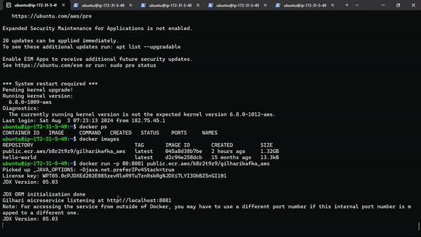
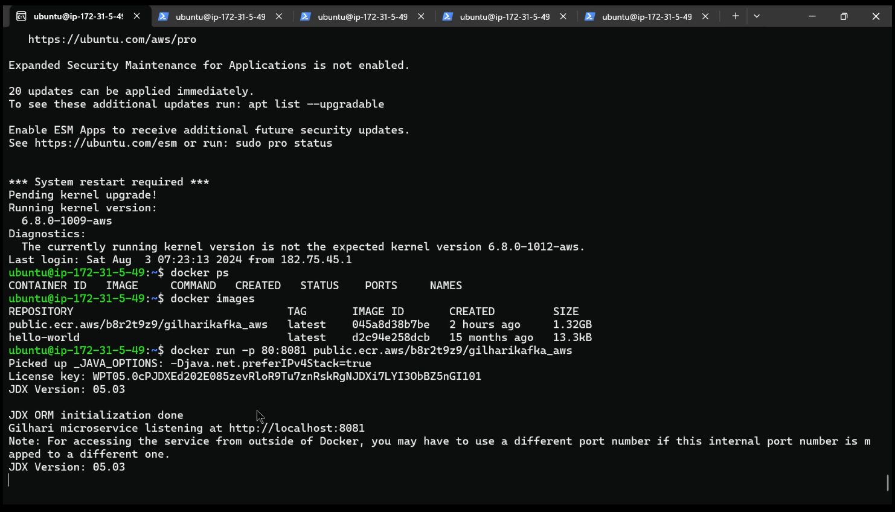
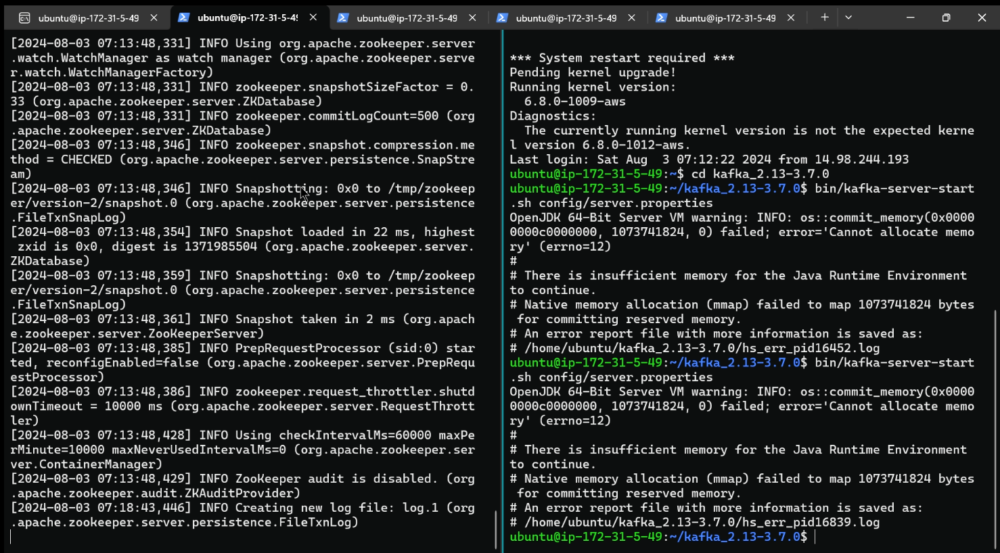
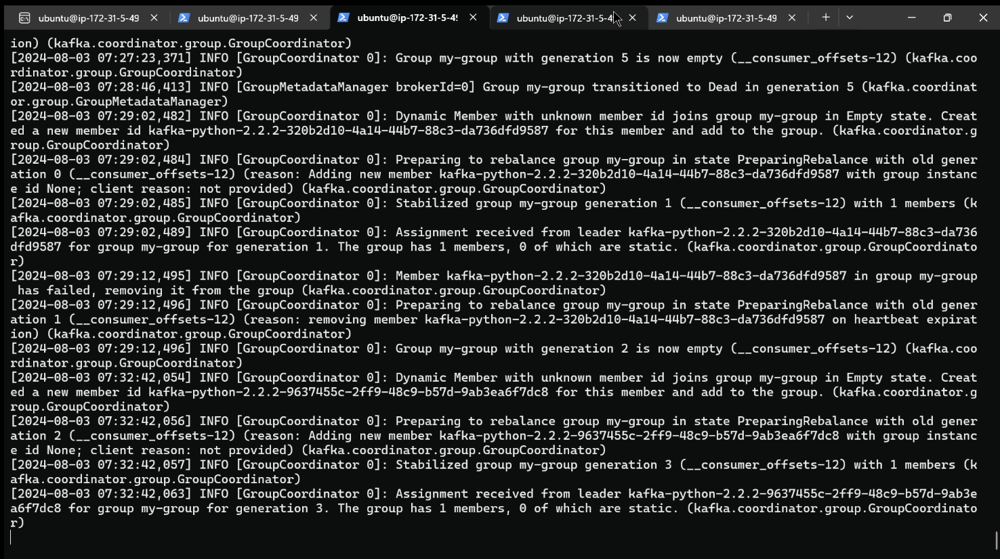
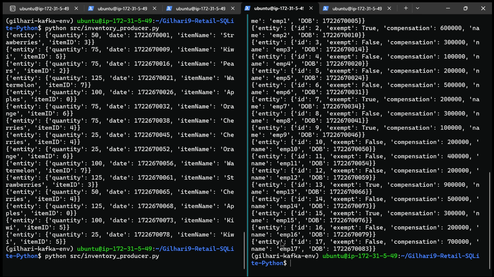
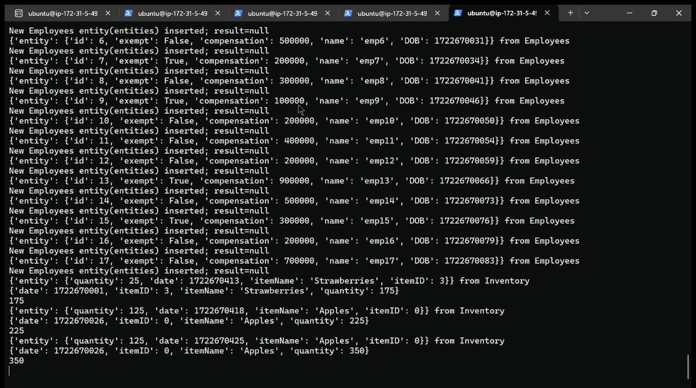

# Retail Management System using Apache Kafka Streaming Service with Gilhari

## About Gilhari
This project uses Gilhari microservice framework to exchange JSON data with relational databases. Gilhari is a product of Software Tree, LLC. GilhariTM is a microservice framework to provide persistence for JSON objects in relational databases. Available in a Docker image, it is configurable as per an app-specific object and relational models. Gilhari exposes a REST (REpresentational State Transfer) interface to provide APIs (POST, GET, PUT, DELETE…) for CRUD (Create, Retrieve, Update, and Delete) operations on the app-specific JSON objects. You may get more information about Gilhari and its SDK at https://www.softwaretree.com.

## About the Project
This is a case-based example of how to use the Gilhari microservice framework to transfer json data from an Apache Kafka streaming server to a PostgreSQL/MySQL/SQLite database.
* This project simulates a retail business in which 3 types of data - Employee data (as hires), Sales data (as sales transactions), and Inventory data (as shipment transactions) are being continuously generated.
* 3 tables exist in the database to record such information:
    1. Employee
    2. Sales
    3. Inventory
* Each type is its own topic, and each topic's data stream is being generated by its own producer python script - `src/employees_producer.py`, `src/sales_producer.py`, `src/inventory_producer.py`.
* The data in the topics are received by a consumer in the client python script `src/consumer_client.py`.
* The client makes requests to the Gilhari REST API (GET, POST, PATCH requests) to make changes to the tables in the database. 
* The producers and consumer scripts run independent of one another.
* Notice that using the Gilhari microservice framework in the consumer program eliminates the need to write any SQL code for storing JSON data in a relational database.\
Gilhari does not require any database native JSON data type. \
Also, the database-agnostic framework of Gilhari makes it very easy to switch the backend relational database (e.g., from Postgres to MySQL/SQLite) without having to write any code.

The steps to configure Gilhari, the database(s), Kafka, the project environment and the steps to run the project are given below.

The project has also been deployed to AWS' RDS and EC2 to demonstrate Gilhari's seamless integration with cloud instances.

# Setting up Gilhari microservice
Proceed to `/Gilhari9/README.md` and follow the instructions there to create a project-specific Gilhari image.

# Setting up the database
The `.jdx` ORM file in `Gilhari9/config/` contains the mapping commands for each of these databases. To change, simply comment out the ones that are not in use, and change the path to the JDBC driver in `Gilhari9/gilhari_service.config` to the respective database's JDBC driver `.jar` file. 
## PostgreSQL
With a user `postgres` and password `psql`, create a new database called `gilharikafkadb`. Run the server on localhost at port 5432.

## MySQL
With a user `mysqluser` and password `mysqlpassword`, create a new database called `gilharikafkadb`. Run the server on localhost at port 3306.

*NOTE: You may change the authentication details and port numbers for each of the above databases. Make sure you change the same in the `.jdx` ORM file.*

## SQLite
No authentication details are required. Simply make sure that the docker container is mapped to a local volume so that changes made by gilhari are reflected in the local volume and persist even after the container is stopped. Details on the CLI argument to be passed to ensure this are given in the `README.md` file in `Gilhari9/`.

# Setting up project environment
Follow these steps to set up your dev/testing environment

## Step 1: Install Python 3.10
Install python 3.10 from official sources. Ensure you are using python 3.10 by running the command `python --version`

## Step 2: Cloning repository and setting up virtual environment
Clone this repository and navigate to the root of your local repository in a terminal. Then, run the command `python -m venv gilhari-kafka-env`

Activate the environment by running the command:

`gilhari-kafka-env/Scripts/activate.bat` (Windows command prompt)

`gilhari-kafka-env/Scripts/activate.ps1` (Windows powershell)

`source gilhari-kafka-env/bin/activate` (MacOS/Linux)

## Step 3: Install requirements from requirements.txt
run the command `pip install -r requirements.txt` after activating the virtual environment

verify installation by running the command `pip list`

# Setting up Kafka data streaming server
Navigate to your kafka directory (eg, home/usr/kafka_2.13-3.7.0) and run the following commands in separate terminals

## Start zookeeper server (default port 2181)
run the command `bin/zookeeper-server-start.sh config/zookeeper.properties`

## Start kafka server (default port 9092)
run the command `bin/kafka-server-start.sh config/server.properties`

## Stopping the servers
run the commands

`bin/kafka-server-stop.sh`

`bin/zookeeper-server-stop.sh`

# Running the project
Follow the above steps to set up both servers and the docker container. Then in a new terminal located in the root directory of the project, proceed to the following:

## Generate data using a producer application
run the commands `python src/inventory_producer.py`, `python src/employees_producer.py`, `python src/sales_producer.py`

**NOTE**: The sales transactions require there to be inventory records as in any retail business.\
There exists no explicit code to populate the inventory.\
You must run just the inventory production driver and consumer to first populate the inventory.\
Then you may run all 3 producers with the consumer simultaneously. 

## Retrieving json data using the consumer
run the command `python src/consumer_client.py`

# Deploying to AWS
Deploying the project to AWS consists of 3 parts - creating a database instance, pushing the project-specific Gilhari image to an ECR repository, and then creating an EC2 instance that allows one to pull the docker image and run the rest of the source code.

## Setting up PostgreSQL RDS database instance
To do this, a Postgresql database must be created created using Amazon RDS(Relational Database Service) with public access to its IP. \
* To avoid any issues the security group must be configured with inbound and outbound rules such that IPV4 and IPV6 traffic from one's system is allowed to access the database and bypass the firewall else Gilhari would be unable to connect to the database. 
* Following this, in the ORM file we provide the link in the format `YOUR_RDS_INSTANCE_ENDPOINT:5432/DB_NAME` where `YOUR_RDS_INSTANCE_ENDPOINT` refers to the endpoint that is provided by AWS and can be copied from the webpage showing the details of the database being hosted. 
* Username and password used must also be mentioned in the ORM file to allow Gilhari access to the database. One must also ensure to delete the database instance once usage of it is completed as merely stopping the instance does not prevent getting charged as it incurs storage costs.

## Pushing Project-Specific Gilhari Image to an ECR Repository
This step involves setting up a public repository on Amazon Elastic Container Registry(ECR) with some repo name. Following this the AWS Command Line Interface must be installed to run aws commands to push the docker image of Gilhari to ECR.\
* An IAM user must be created with policies of AmazonEC2ContainerRegistryFullAccess and AmazonElasticContainerRegistryPublicFullAccess attached. 
* An access key is created in the security credentials tab of the user and the access key and secret access key is used when we open the CLI and type aws configure which prompts an answer to the above categories.
* The commands to push a docker image to the registry are as mentioned in the view push commands option seen when the repository is clicked. Those commands are to be copied and pasted exactly as mentioned.
* Upon completion of this step, the image will be available in the created repository, from which it can be pulled by an EC2 instance

## Deploying Source Code to an EC2 Instance
This step involves creating a public cluster in Amazon Elastic Cluster Service with Amazon EC2 instances for the infrastructure. 
* A SSH key pair is also to be created using a .pem file format. The same security group that we used to connect to RDS is also used here. One must also ensure that for the Auto Assign Public IP section, the option of ‘turn on’ must be selected.
* After an EC2 instance is created, one may connect to it using the SSH private key. On clicking the instance id, one must click the connect button and go to the SSH client tab. On going to the directory housing the downloaded key1.pem file through the terminal, run the command given under example of the SSH client tab.
* Pull the docker image from the ECR repository created in the previous step to run the Gilhari microservice.
* Install Kafka onto the EC2 instance.
* Pull the git repository with the source code onto the EC2 instance. From there, one may follow the same steps to run the project as given previously.

# Demo of the Project running on AWS

The above gif shows the various services running simultaneously on the EC2 instance. Individual services are tagged in the following screenshots.

### Gilhari microservice running in docker container

### Zookeeper server

### Kafka server

### Producers Running Together

### Consumer pushing data to PostgreSQL instance via Gilhari
